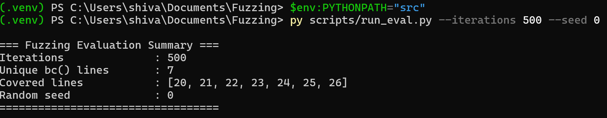

[](https://github.com/shivanipoosarla/Fuzzing/actions/workflows/tests.yml)

# FuzzLab: Coverage-Guided Fuzzing Experiments

A small experimental fuzzing framework implementing:

* Random fuzzing
* Mutation-based fuzzing
* AFL-inspired mutation operators
* Coverage tracking using dynamic instrumentation
* Reproducible CLI-based evaluation
* Automated unit tests with CI

This project explores how simple mutation strategies impact branch coverage in a target function.


## Why This Project

Modern security testing relies heavily on fuzzing. Even simple mutation strategies can dramatically improve coverage compared to naïve random input generation.

This repository demonstrates:

* How mutation operators affect exploration
* How to measure coverage programmatically
* How to structure fuzzing experiments reproducibly
* How to build a minimal but engineered fuzzing workflow


## Quick Start (Windows / PowerShell)

Clone the repository:

```powershell
git clone https://github.com/shivanipoosarla/Fuzzing.git
cd Fuzzing
```

Create and activate a virtual environment:

```powershell
py -3.11 -m venv .venv
.\.venv\Scripts\Activate.ps1
```

Install minimal dependencies:

```powershell
python -m pip install --upgrade pip
pip install pytest matplotlib markdown pyparsing==2.4.7
pip install --no-deps fuzzingbook
```

## Run CLI Evaluation

```powershell
$env:PYTHONPATH="src"
py scripts/run_eval.py --iterations 200 --seed 0
```

Example output:

```
=== Fuzzing Evaluation Summary ===
Iterations: 200
Unique bc() lines covered: 3
Covered lines: [...]
Seed: 0
```
### Example Output



## Run Tests

```powershell
$env:PYTHONPATH="src"
pytest -q
```

CI runs automatically on every push.


## Project Structure

```
Fuzzing/
├── .github/
│ └── workflows/
│ └── tests.yml # GitHub Actions CI workflow
│
├── docs/
│ └── cli_run_example.png # Example CLI output screenshot
│
├── notebooks/
│ └── Fuzzing_Exercises_Solution.ipynb
│
├── scripts/
│ └── run_eval.py # CLI runner for fuzzing experiments
│
├── src/
│ └── fuzzlab/
│ ├── init.py
│ ├── targets.py # Target functions under test
│ ├── fuzzers.py # Random + mutation fuzzers
│ └── evaluation.py # Coverage experiment logic
│
├── tests/
│ ├── test_targets.py
│ └── test_mutations.py
│
├── pyproject.toml
├── requirements.txt
├── README.md
└── .gitignore
```

## Implemented Mutation Strategies

* Single-character mutation
* AFL-style bitflip
* Known-integer insertion

These operators demonstrate how small input perturbations can increase path exploration compared to naive random generation.


## Future Extensions

* Coverage growth visualization
* Corpus persistence
* Additional mutation operators
* Structured input fuzzing
* Comparison against grammar-based fuzzing

## License

This project is for educational and experimental purposes.